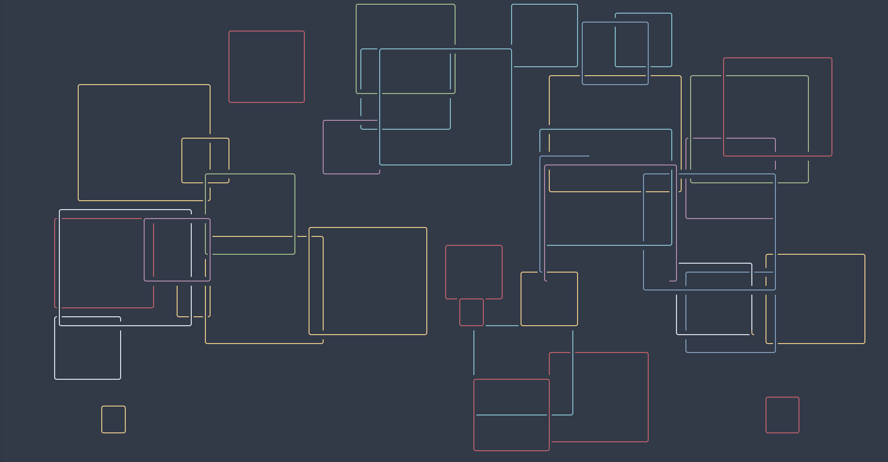
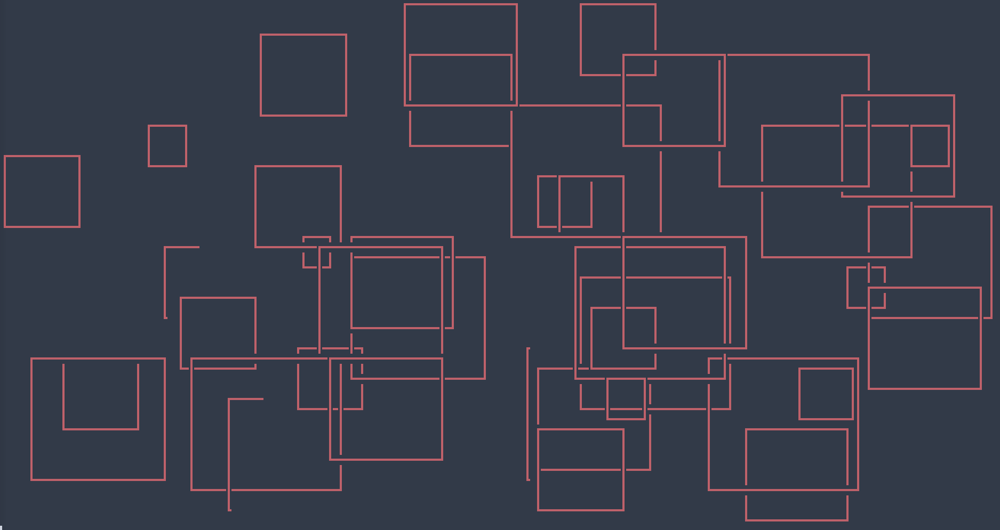
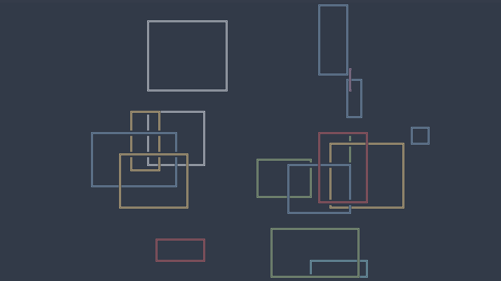

# C-SQUARES

This program written in the C language will render random coloured rectangulars in the terminal, while the font, speed, density, color, ratio and number of  the shapes drawn are fully costumizable.

[{height=200}](https://www.youtube.com/watch?v=ccqlEQBE-bY)

_Click on image to watch video_

Every time a rectangular is complete, a new one starts to take shape.

This script was inspired by this bash script:

[https://github.com/pipeseroni/pipes.sh](https://github.com/pipeseroni/pipes.sh)

It also is a variation of another project of mine:

[https://gitlab.com/christosangel/c-pipes](https://gitlab.com/christosangel/c-pipes)

---

## INSTALL

First the user has to clone the repo:

```
git clone https://gitlab.com/christosangel/c-squares.git
```
After changing directory to `c-squares/`, the c script is compiled:

```
cd c-squares&&gcc c-squares.c -Wall -o c-squares
```

That's it!

---

**NOTICE:**

- Before running the script, make sure that you have a font that includes **box drawings characters** installed in your system.

- Also, the terminal window should have dimensions between the minimum and maximum sizes:

     |Dimension|minimum|maximum|
     |---|---|---|
    |_Height_|8 rows|67 rows|
    |_Width_|12 columns|270 columns|

- Moving around / resizing excessively the terminal window on the screen **may** result in dump cores.


---
## RUN / USAGE


Now the user is ready can run the executable:

```
./c-squares
```

You may want to add the flags that you prefer in order to have the outcome of your liking.

---

## FLAGS

The user can either use the short or the long flag version (i.e. c-squares -h and c-squares --help are the same).

|n|Short flag|Long flag|Explanation|Acceptable Values|Default Value|
|---|---|---|---|---|---|
|1|`-h`|`--help`|Shows this help text.||
|2|`-l`|`--lines`|Defines the number of lines rectangulars drawn on the terminal window at any moment.| 1-9 |2|
|3|`-s`|`--speed`|Defines the speed of the drawing.|0-9| 3|
|4|`-d`|`--dense`|Defines the density of the rectangulars  drawn before the screen is empty again.|1-9|5|
||||`1` Screen refreshed after only a few rectangulars.|
||||`9` Screen packed with shapes.|
|5|`-f`|`--font`|Defines the font of the lines.| 0-9|1|
||||`0` Chars used:─│┘┐└┌|
||||`1` Chars used:─│╯╮╰╭|
||||`2` Chars used:━┃┛┓┗┏|
||||`3` Chars used:═║╝╗╚╔|
||||`4` Chars used:┈┊┐┘└┌|
||||`5` Chars used:┄┆┘┐└┌|
||||`6` Chars used:┅┇┛┓┗┏|
||||`7` Chars used:┉┋┛┓┗┏|
||||`8` Chars used:↑↓↗↖↘↙←→|
||||`9` Chars used:█|
|6|`-t`|`--type`|Defines the type of rectangulars rendered on the screen.|0-3|0|
||||`0`: Perfect squares (almost).|
||||`1`: Width bigger than height.|
||||`2`: Height bigger than width.|
||||`3`: Random width/height ratio.|
|7|`-m`|`--monochrome`|Renders single colored lines. If this flag is ommitted, each line gets a random color.|0-7|`null`|
||||`0` black|
||||`1` red|
||||`2` green|
||||`3` yellow|
||||`4` blue|
||||`5` magenta|
||||`6` cyan|
||||`7` white|

---

## EXAMPLES

```
./c-squares
```

will render rectangulars with the default values:

{height=200}

---

```
./c-squares -f 2 -m 1 -d 7 -l 4
```

will produce a quite dense screen with 4 rapid red squares with sharp angles drawn simultaneously:

{height=200}

---

```
./c-squares -f 3  -l 1 -t 3
```

will produce a screen with one random width/height ratio double-lined rectangular  drawn:

{height=200}

---
Feel free to explore the endless variations!

---
